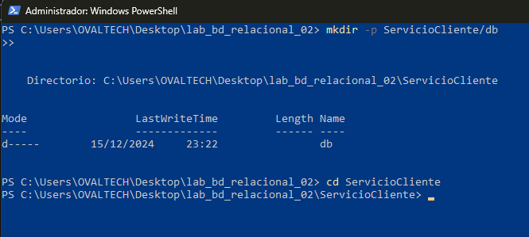
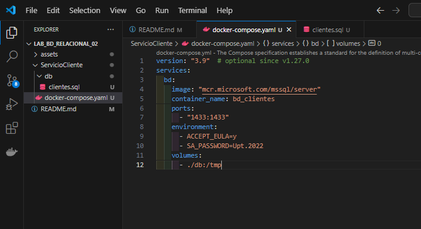
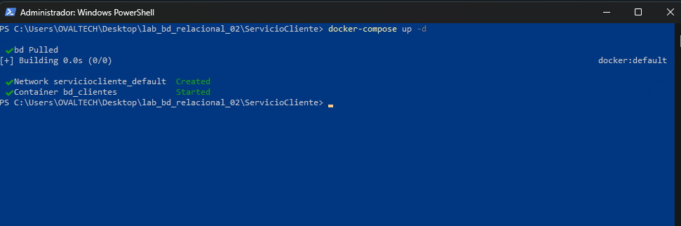

# SESION DE LABORATORIO N° 02: Consumiendo datos de una base de datos Microsoft SQL Server

### Nombre: Mayner Gonzalo Anahua Coaquira

## OBJETIVOS

- Comprender el funcionamiento de una aplicación que consume una base de datos relacional contenerizada.

## REQUERIMIENTOS

- Conocimientos:
  - Conocimientos básicos de administración de base de datos Microsoft SQL Server.
  - Conocimientos básicos de SQL.
  - Conocimientos shell y comandos en modo terminal.
- Hardware:
  - Virtualization activada en el BIOS.
  - CPU SLAT-capable feature.
  - Al menos 4GB de RAM.
- Software:
  - Windows 10 64bit: Pro, Enterprise o Education (1607 Anniversary Update, Build 14393 o Superior)
  - Docker Desktop
  - Powershell versión 7.x
  - .Net 6 o superior

## CONSIDERACIONES INICIALES

- Clonar el repositorio mediante git para tener los recursos necesaarios
- Verificar que otro servicio no este utilizando el puerto 1433. Desactivarlo si existiese.

## DESARROLLO

1. Iniciar la aplicación Docker Desktop:


2. Iniciar la aplicación Powershell o Windows Terminal en modo administrador


3. En el terminal, ubicarse en un ruta que no sea del sistema. Crear la carpeta "ServicioCliente" y dentro de esta crear la carpeta "db".

```Bash
mkdir -p ServicioCliente/db
cd ServicioCliente
```



1. Iniciar Visual Studio Code desde el terminal.

```Bash
code .
```


1. En Visual Studio Code, dentro de la carpeta db, añadir el archivo clientes.sql, oon el siguiente contenido:

```SQL
if (DB_ID(N'BD_CLIENTES') IS NOT NULL)
    DROP DATABASE BD_CLIENTES
GO
CREATE DATABASE BD_CLIENTES ON
  PRIMARY (
    NAME = N'BD_CLIENTES',
    FILENAME = N'/var/opt/mssql/data/BD_CLIENTES.mdf',
    SIZE = 50MB ,
    FILEGROWTH = 10MB
  ) LOG ON (
    NAME = N'BD_CLIENTES_log',
    FILENAME = N'/var/opt/mssql/data/BD_CLIENTES_log.ldf',
    SIZE = 10MB ,
    FILEGROWTH = 5MB
  )
GO
USE BD_CLIENTES
GO
CREATE TABLE CLIENTES (
    ID_CLIENTE INT IDENTITY NOT NULL CONSTRAINT PK_CLIENTES PRIMARY KEY,
    NOM_CLIENTE VARCHAR(100) NOT NULL
)
GO
CREATE TABLE TIPOS_DOCUMENTOS (
    ID_TIPO_DOCUMENTO TINYINT IDENTITY NOT NULL CONSTRAINT PK_TIPOS_DOCUMENTOS PRIMARY KEY,
    DES_TIPO_DOCUMENTO VARCHAR(50) NOT NULL
)
GO
CREATE TABLE CLIENTES_DOCUMENTOS (
    ID_CLIENTE INT NOT NULL,
    ID_TIPO_DOCUMENTO TINYINT NOT NULL,
    NUM_DOCUMENTO VARCHAR(15) NOT NULL,
    CONSTRAINT PK_CLIENTES_DOCUMENTOS PRIMARY KEY (ID_CLIENTE, ID_TIPO_DOCUMENTO),
    CONSTRAINT FK_CLIENTES_DOCUMENTOS_X_CLIENTE FOREIGN KEY (ID_CLIENTE) REFERENCES CLIENTES(ID_CLIENTE),
    CONSTRAINT FK_CLIENTES_DOCUMENTOS_X_TIPO_DOCUMENTO FOREIGN KEY (ID_TIPO_DOCUMENTO) REFERENCES TIPOS_DOCUMENTOS(ID_TIPO_DOCUMENTO)
)
GO
INSERT TIPOS_DOCUMENTOS(DES_TIPO_DOCUMENTO)
VALUES ('DNI'),('RUC')
GO
```


1. En Visual Studio Code, en en la raiz del proyecto, añadir un archivo docker-compose.yaml, con el siguiente contenido:

```YAML
version: "3.9"  # optional since v1.27.0
services:
  bd:
    image: "mcr.microsoft.com/mssql/server"
    container_name: bd_clientes
    ports:
      - "1433:1433"
    environment:
      - ACCEPT_EULA=y
      - SA_PASSWORD=Upt.2022
    volumes:
      - ./db:/tmp
```



1. En el terminal anteriormente abierto o abrir uno en Visual Studio Code, y dentro de la carpeta ServicioCliente ejecutar el siguiente comando

```Bash
docker-compose up -d
```


1. En el terminal, esperar un minuto que inicie correctamente el contenedor y ejecutar el siguiente comando:

```Bash
docker exec -it bd_clientes /opt/mssql-tools/bin/sqlcmd -S localhost -U sa -P Upt.2022 -i /tmp/clientes.sql
```


### Correccion #1 - Usar la imagen `mcr.microsoft.com/mssql/server:2022-CU10-ubuntu-22.04`

---

La imagen `mcr.microsoft.com/mssql/server` siendo la ultima version este `16/12/2024`, no tenia instalado `sqlcmd` asi que se uso `mcr.microsoft.com/mssql/server:2022-CU10-ubuntu-22.04`

Se busco la Versión de compilación de SQL Server `16.0.4095.4` en:

- [Microsoft Learn Challenge](https://learn.microsoft.com/es-es/troubleshoot/sql/releases/sqlserver-2022/build-versions)

- [GitHub - MicrosoftDocs/SupportArticles-docs](https://github.com/MicrosoftDocs/SupportArticles-docs/blob/main/support/sql/releases/linux/release-history-2022.md#CU10)

Ademas de la imagen en `Microsoft Artifact Registry` usando `Filter: 2022-CU10` para encontrar `2022-CU10-ubuntu-22.04` en:

- [Microsoft Artifact Registry](https://mcr.microsoft.com/en-us/artifact/mar/mssql/server/tags)

Cambiamos el `docker-compose.yml` agregando el tag `2022-CU10-ubuntu-22.04`

```yml
version: "3.9" # optional since v1.27.0
services:
  bd:
    image: "mcr.microsoft.com/mssql/server:2022-CU10-ubuntu-22.04"
    container_name: bd_clientes
    ports:
      - "1433:1433"
    environment:
      - ACCEPT_EULA=y
      - SA_PASSWORD=Upt.2022
    volumes:
      - ./db:/tmp
```


Volvemos a la terminal y ejecutamos nuevamente pero ahora con la imagen con el tag `2022-CU10-ubuntu-22.04`

```Bash
docker-compose up -d
```



Esperamos a que inicie correctamente y ejecutamos:

```Bash
docker exec -it bd_clientes /opt/mssql-tools/bin/sqlcmd -S localhost -U sa -P Upt.2022 -i /tmp/clientes.sql
```

Vemos que ahora se ejecuto correctamente


---

1. En el terminal, seguidamente proceder a instalar las siguientes herramientas de .Net:

```Bash
dotnet tool install -g dotnet-ef
dotnet tool install -g dotnet-aspnet-codegenerator
```


1.  En el terminal, proceder a crear la API para exponer la data ejecutada anteriormente:

```Bash
dotnet new webapi -o ClienteAPI
cd ClienteAPI
```


1.  En el terminal, Ahora agregar las librerias que se necesitara en la aplicación con el siguiente comando

```Bash
dotnet add package Microsoft.EntityFrameworkCore.Design
dotnet add package Microsoft.EntityFrameworkCore.Tools
dotnet add package Microsoft.EntityFrameworkCore.SqlServer
dotnet add package Microsoft.VisualStudio.Web.CodeGeneration.Design
```


1.  En Visual Studio Code, editar el archivo appsetting.json, que se encuentra en el proyecto ClienteAPI, y adicionar lo siguiente despues de la apertura de la primera llave.

```JSON
  "ConnectionStrings": {
    "ClienteDB": "Server=(local);Database=BD_CLIENTES;User Id=sa;Password=Upt.2022;TrustServerCertificate=true"
  },
```


1.  En el Terminal, ubicarse en la carpeta ClienteAPI, ejecutar el siguiente comando para importar las estructuras de datos de la base de datos. (Tener en cuenta las consideraciones iniciales del laboratorio)

```Bash
dotnet ef dbcontext scaffold "Name=ConnectionStrings:ClienteDB" Microsoft.EntityFrameworkCore.SqlServer --context-dir Data --output-dir Models --force
```


### Correccion #2 - Login failed for user 'sa'.

---

El error se debe a que aunque usemos `Server=(local)` o `Server=localhost` en el archivo `appsettings.json` falta especificar el puerto `1433`, lo comprobamos utilizando `SQL Server Management Studio (SSMS)`


Ahora usando `localhost,1433`


Por lo que cambiamos la cadena de conexion o `ConnectionStrings` en `appsettings.json`

```json
{
  "ConnectionStrings": {
    "ClienteDB": "Server=localhost,1433;Database=BD_CLIENTES;User Id=sa;Password=Upt.2022;TrustServerCertificate=true"
  },
  "Logging": {
    "LogLevel": {
      "Default": "Information",
      "Microsoft.AspNetCore": "Warning"
    }
  },
  "AllowedHosts": "*"
}
```


Volvemos a la terminal y ejecutamos nuevamente el comando para crear los modelos en `Models`:

```Bash
dotnet ef dbcontext scaffold "Name=ConnectionStrings:ClienteDB" Microsoft.EntityFrameworkCore.SqlServer --context-dir Data --output-dir Models --force
```

Vemos que ya no nos aparece el error ya que ahora estamos especificando el puerto que hace referencia al contenedor que creamos al inicio


---

1.  En Visual Studio Code, modificar la clase creada BdClientesContext que se encuentra en el proyecto ClienteAPI en la carpeta Data. Buscar: `Name=ConnectionStrings:ClienteDB` y reemplazar por `ClienteDB`


2.  En el terminal, ubicarse en la carpeta ClienteAPI, ejecutar el siguiente comando para generar el Controlador que expondra los datos mediante el API.

```Bash
dotnet aspnet-codegenerator controller -name TiposDocumentosController -async -api -m TiposDocumento -dc BdClientesContext -outDir Controllers
```


1.  En Visual Studio Code, modificar el archivo program.cs, al inicio del archivo agregar

```C#
using ClienteAPI.Data;
using Microsoft.EntityFrameworkCore;
```


1.  En Visual Studio Code, modificar el archivo program.cs, debajo de la linea que indica `// Add services to the container`.

```C#
builder.Services.AddDbContext<BdClientesContext>(opt => opt.UseSqlServer(builder.Configuration.GetConnectionString("ClienteDB")));
```

Ademas agregamos las siguientes lineas en `Program.cs`

```cs
builder.Services.AddControllers();// Agregar esta linea (1)
```

```cs
//app.UseHttpsRedirection();
app.MapControllers();// Agregar esta linea (2)
```


1.  Nuevamente en el terminal, ubicarse en la carpeta ClienteAPI. Ejecutar el comando `dotnet build` para compilar la aplicación y verificar que se esta construyendo correctamente.


Arreglamos un conflicto de redundancia en `BdClientesContext.cs` colocando el metodo `OnConfiguring()` de la siguiente manera:

```cs
    protected override void OnConfiguring(DbContextOptionsBuilder optionsBuilder)
    {
        //=> optionsBuilder.UseSqlServer("ClienteDB");// Antes: Name=ConnectionStrings:ClienteDB
    }
```


2.  (Opcional) en el terminal, ubicarse en la carpeta ClienteAPI, ejecutar el comando `dotnet run` para iniciar la aplicación. Anotar el numero de puerto que aparecera: Now listening on: http://localhost:5280. Abrir un navegador de internet e ingresar la url: http://localhost:5280/swagger


3.  En Visual Studio Code, para completar crear el archivo Dockerfile dentro del proyecto ClienteAPI, con el siguiente contenido.

```Dockerfile
FROM mcr.microsoft.com/dotnet/aspnet:7.0 AS base
WORKDIR /app
EXPOSE 80

FROM mcr.microsoft.com/dotnet/sdk:7.0 AS build
WORKDIR /src
COPY ["ClienteAPI.csproj", "."]
RUN dotnet restore "./ClienteAPI.csproj"
COPY . .
WORKDIR "/src/."
RUN dotnet build "ClienteAPI.csproj" -c Release -o /app/build

FROM build AS publish
RUN dotnet publish "ClienteAPI.csproj" -c Release -o /app/publish /p:UseAppHost=false

FROM base AS final
WORKDIR /app
COPY --from=publish /app/publish .
ENTRYPOINT ["dotnet", "ClienteAPI.dll"]
```


21. En Visual Studio Code, modificar y completar el archivo docker-compose.yaml con el siguiente contenido al final del archivo.

```YAML
  api:
    build: ClienteAPI/. # build the Docker image
    container_name: api_clientes
    ports:
      - "5000:80"
    environment:
      - ConnectionStrings__ClienteDB=Server=bd_clientes;Database=BD_CLIENTES;User Id=sa;Password=Upt.2022;TrustServerCertificate=true
    depends_on:
      - bd
```


22. En Visual Studio Code, modificar el archivo program.cs, comentar las siguientes lineas.

```C#
// if (app.Environment.IsDevelopment() )
// {
    app.UseSwagger();
    app.UseSwaggerUI();
//}
```


23. Nuevamente en el terminal, ubicarse en la carpeta ClienteAPI. Ejecutar el comando `dotnet build` para compilar la aplicación y verificar que se esta construyendo correctamente.


24. En el terminal, ubicarse en la carpeta ServicioCliente y ejecutar el siguiente comando

```Bash
docker-compose up -d
```

Ya que en mi caso estoy usando .NET 8.0 actualizare las imagenes que se utilizan en el `Dockerfile` de la siguiente manera:

```Dockerfile
FROM mcr.microsoft.com/dotnet/aspnet:8.0 AS base
WORKDIR /app
EXPOSE 80

FROM mcr.microsoft.com/dotnet/sdk:8.0 AS build
WORKDIR /src
COPY ["ClienteAPI.csproj", "."]
RUN dotnet restore "./ClienteAPI.csproj"
COPY . .
WORKDIR "/src/."
RUN dotnet build "ClienteAPI.csproj" -c Release -o /app/build

FROM build AS publish
RUN dotnet publish "ClienteAPI.csproj" -c Release -o /app/publish /p:UseAppHost=false

FROM base AS final
WORKDIR /app
COPY --from=publish /app/publish .
ENTRYPOINT ["dotnet", "ClienteAPI.dll"]

```


Y compilamos la aplicacion nuevamente con:

```bash
dotnet build
```


De la misma manera ejecutamos:

```bash
docker-compose up -d
```


Se contruyo correcatmente e inicio el contenedor, sin embargo en el `docker-compose.yml` se hara un ajuste respecto al mapeo de los puertos, se usara `5000:8080`


Ejecutamos lo siguiente para visualizar los cambios:

```bash
docker-compose up --build
```


1.  Abrir un navegador de internet e ingresar la url: http://localhost:5000/swagger, ejecutar una peticion GET para TiposDocumentos, la cual deberá devolver lo siguiente:


Mi resultado:


---

## Actividades Encargadas

1. Completar los controladores para las clases `Cliente` y `ClientesDocumento`.

Para ello utilizamos el comando que se uso para `TiposDocumento`, aqui lo que representa cada parametro:

| Parámetro | Descripción                                            |
| --------- | ------------------------------------------------------ |
| `-name`   | Nombre del controlador.                                |
| `-async`  | Genera métodos asincrónicos.                           |
| `-api`    | Crea controladores para una API.                       |
| `-m`      | Especifica la clase de modelo.                         |
| `-dc`     | Especifica el contexto de datos (`BdClientesContext`). |
| `-outDir` | Directorio donde se guardará el controlador generado.  |

Ejecutamos el siguiente comando para generar el Controlador para `Cliente`

```Bash
dotnet aspnet-codegenerator controller -name ClientesController -async -api -m Cliente -dc BdClientesContext -outDir Controllers
```


Ejecutamos el siguiente comando para generar el Controlador para `ClientesDocumento`

```Bash
dotnet aspnet-codegenerator controller -name ClientesDocumentosController -async -api -m ClientesDocumento -dc BdClientesContext -outDir Controllers
```


Para reflejar estos cambios en el contenedor de la API, ejecutamos:

- Primero detenemos los contenedores:

```bash
docker-compose down
```


- Y los volvemos a levantaar:

```bash
docker-compose up --build -d
```


Ejecutamos el script `db/clientes.sql` para crear la db nuevamente:

```bash
docker exec -it bd_clientes /opt/mssql-tools/bin/sqlcmd -S localhost -U sa -P Upt.2022 -i /tmp/clientes.sql
```


Nota: Aun asi, se recomiendaria utilizar migraciones

Resultado final:


### Otras consideraciones:

- Se uso el comando para crear el archivo `.gitignore`

```bash
dotnet new gitignore
```

- Para restaurar el proyecto local:

```bash
dotnet restore
dotnet build
dotnet run
```
